# Parte 1 — Entornos de trabajo

En esta parte de la práctica se configuran tres entornos para desarrollar y ejecutar Scala 2.12.21.

## Entorno 1 — JupyterLab + Almond

#### JupyterLab + Almond Kernel

Para comprobar el funcionamiento del primer entorno de trabajo, se inició JupyterLab correctamente desde Windows. Desde su interfaz se puede acceder a los notebooks y a los distintos kernels instalados.

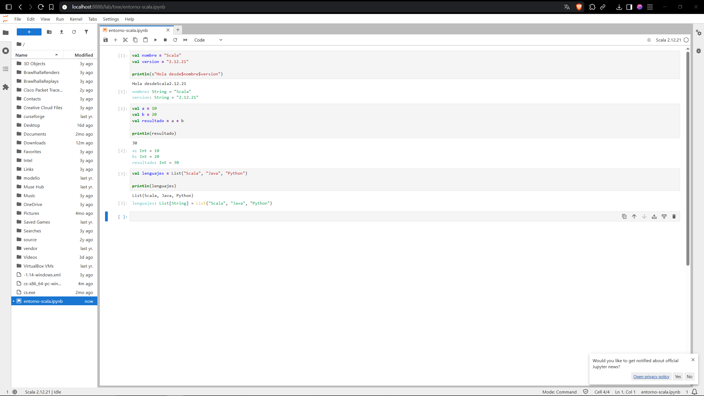

#### Kernel de Scala con Almond

Se instaló Almond como kernel de Scala para Jupyter. Al crear un nuevo Notebook aparece Scala entre los kernels disponibles, confirmando que Almond se ha instalado correctamente.

#### Notebook utilizando Scala

Se creó un nuevo Notebook utilizando el kernel de Scala. De esta forma, las celdas del Notebook pueden ejecutar directamente código escrito en Scala.

#### Versión de Scala

Desde el Notebook se comprobó la versión instalada de Scala. El resultado confirma que el entorno utiliza la versión requerida para la práctica:

#### Pruebas de ejecución

Para verificar el correcto funcionamiento del entorno se realizaron tres pruebas sencillas.

  -En la primera prueba se declararon dos variables con el nombre y la versión de Scala y se mostró el resultado mediante `println`.

  -En la segunda prueba se realizó una operación numérica, sumando dos valores y mostrando el resultado obtenido.

  -Finalmente, se creó una colección de tipo `List` con varios lenguajes de programación y se mostró su contenido.

## Entorno 2 — Visual Studio Code + Metals

#### Comprobación de Java JDK 17

Antes de crear el proyecto Scala se comprobó que Java 17 estaba correctamente instalado en el sistema.

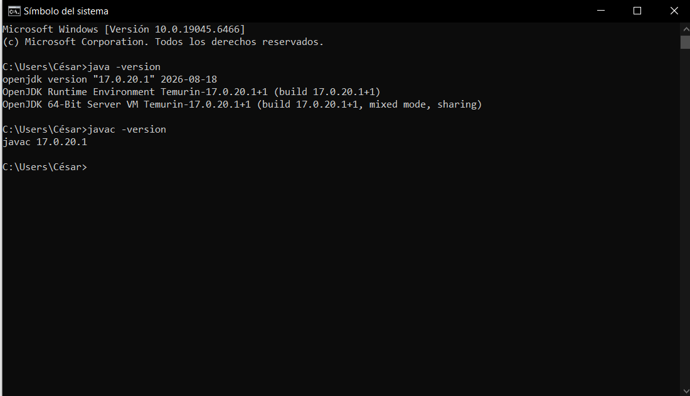

#### Visual Studio Code

Se instaló y ejecutó Visual Studio Code, que se utilizará como editor para el proyecto Scala.

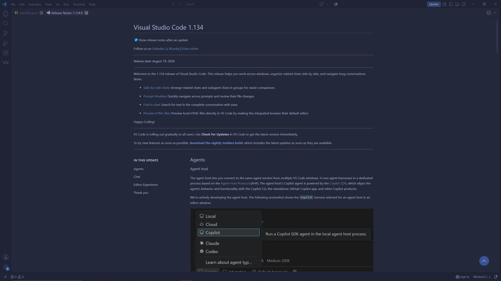

#### Instalación de Metals

Desde el apartado de extensiones de Visual Studio Code se instaló Scala (Metals).

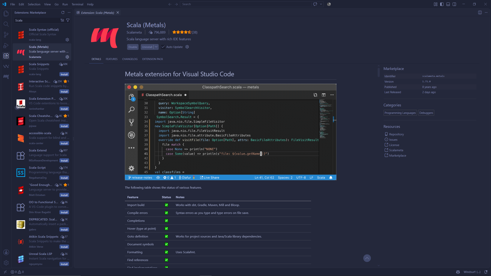

#### Comprobación de sbt

Se comprobó que sbt estaba correctamente instalado y disponible desde el sistema.

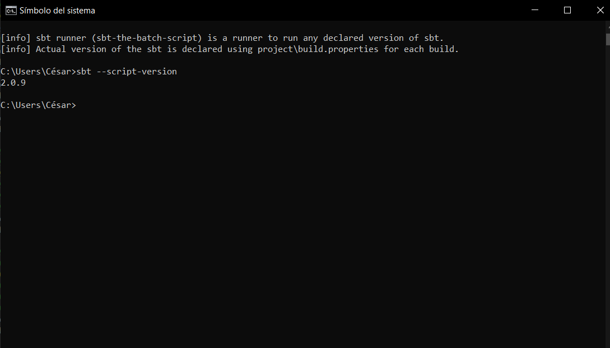

#### Estructura del proyecto

Se creó un proyecto llamado scala-vscode con la estructura habitual de un proyecto Scala gestionado mediante sbt.

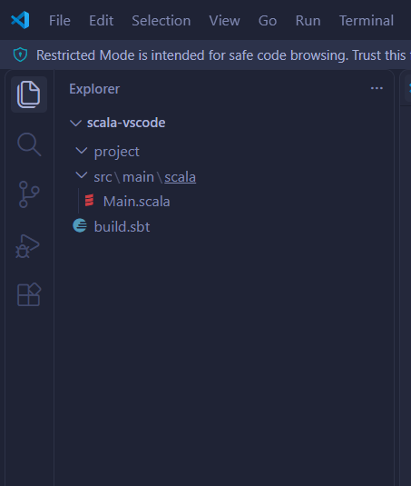

#### Contenido de build.sbt

El archivo build.sbt contiene la configuración principal del proyecto.

En él se especificó explícitamente la versión de Scala requerida para la práctica y el nombre del proyecto.

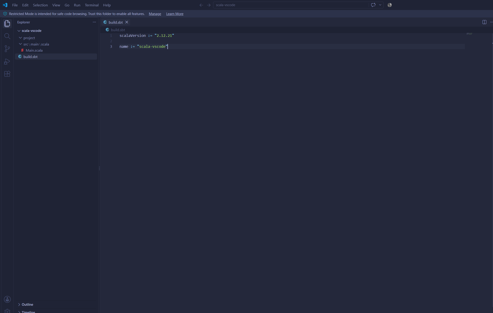

#### Archivo Main.scala

En src/main/scala/ se creó el archivo Main.scala, que contiene el programa principal del proyecto.

El programa muestra varios mensajes por consola para comprobar que el código Scala puede ejecutarse desde este entorno.

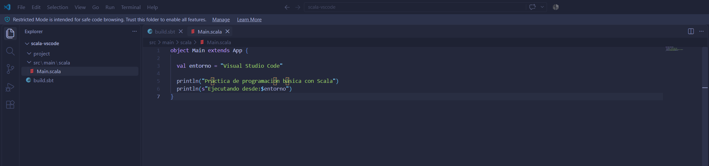

#### Reconocimiento del proyecto por Metals

Al abrir la carpeta del proyecto desde Visual Studio Code, Metals detectó el proyecto sbt y cargó correctamente su configuración.

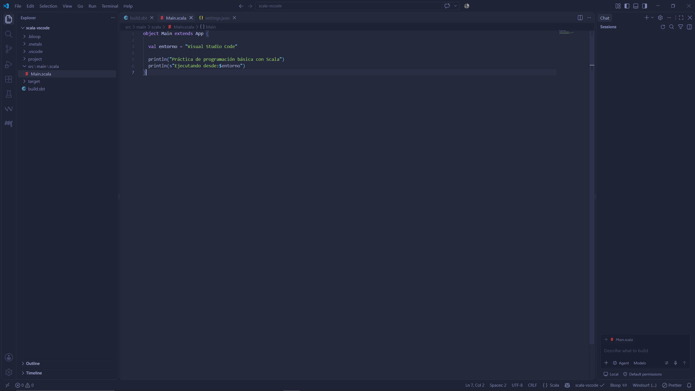

#### Ejecución de sbt compile

Para comprobar que el código era válido y que el proyecto estaba correctamente configurado, se ejecutó sbt compile.

La compilación finalizó correctamente y sin errores.

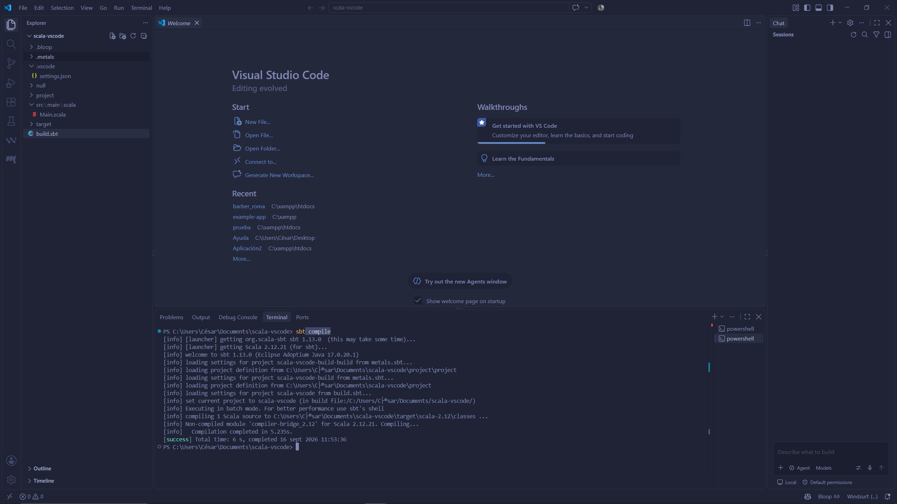

#### Ejecución correcta de sbt run

Finalmente, se ejecutó el programa con sbt run.

La terminal mostró correctamente la salida en Main.scala, confirmando que el proyecto puede compilarse y ejecutarse utilizando Scala 2.12.21 y sbt desde Visual Studio Code.

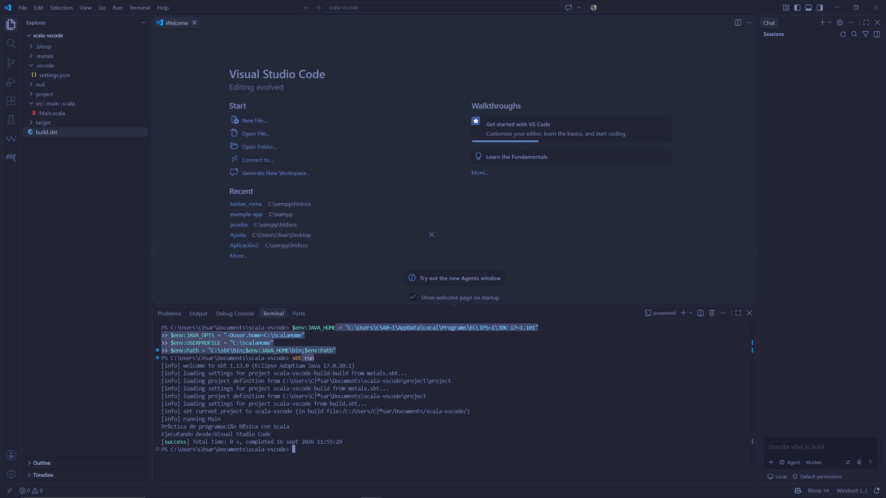

## Entorno 3 — IntelliJ IDEA Community

#### IntelliJ IDEA Community instalado.

Se instaló y ejecutó correctamente IntelliJ IDEA Community Edition, que se utilizará como entorno de desarrollo para el proyecto Scala.

#### Plugin de Scala instalado

Desde el apartado de plugins de IntelliJ IDEA se instaló el plugin Scala.

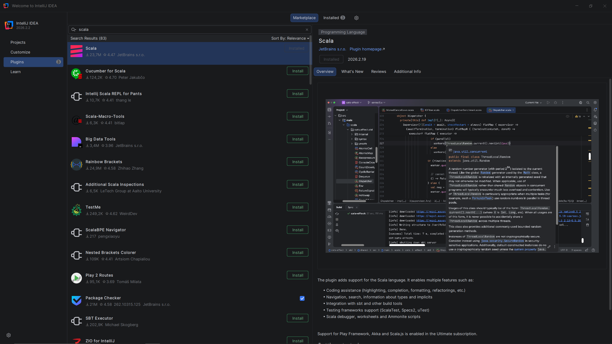

#### JDK 17 configurado

El proyecto se configuró para utilizar JDK 17 como versión de Java.

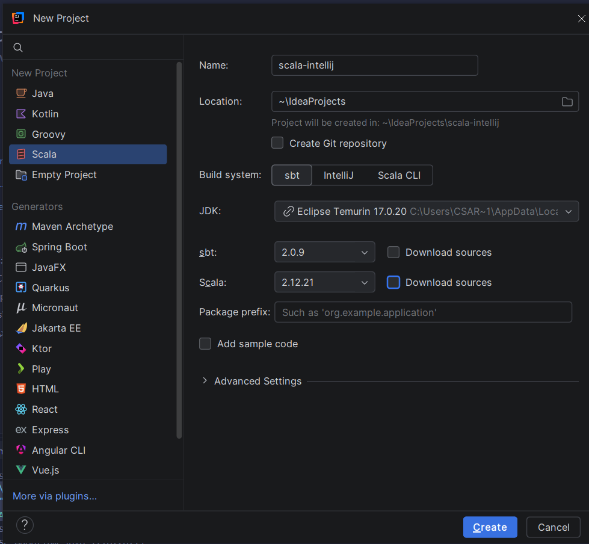

#### Proyecto sbt creado

Se creó un nuevo proyecto llamado scala-intellij utilizando sbt como herramienta de construcción.

#### Scala 2.12.21 configurado

El proyecto se configuró para utilizar la versión requerida de Scala:

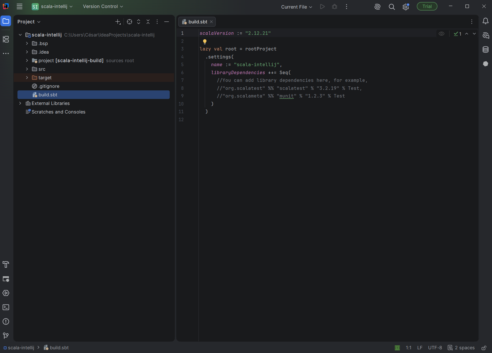

#### Estructura del proyecto

La estructura del proyecto contiene los archivos de configuración de sbt y el código fuente Scala.

#### Archivo build.sbt

El archivo build.sbt contiene la configuración proyecto.

#### Archivo Main.scala

Dentro de src/main/scala/ se creó el archivo Main.scala
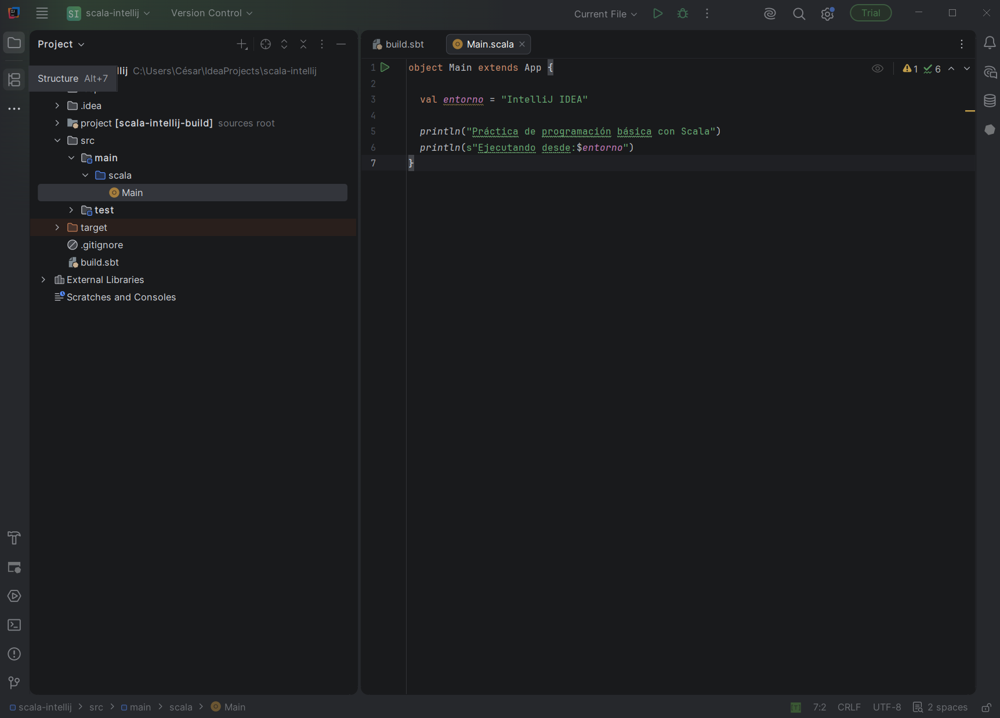

#### Ejecución desde IntelliJ IDEA

El programa se ejecutó utilizando las herramientas de ejecución integradas de IntelliJ IDEA.

La consola del IDE mostró correctamente la salida del programa, confirmando que el proyecto está correctamente configurado.

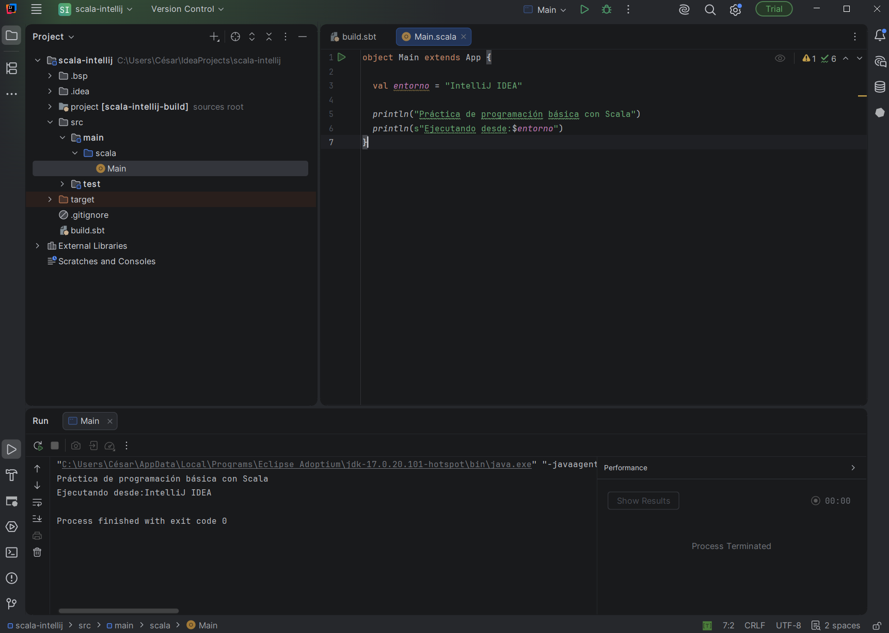

#### Ejecución mediante sbt run

También se comprobó el funcionamiento del proyecto desde la terminal utilizando sbt run.

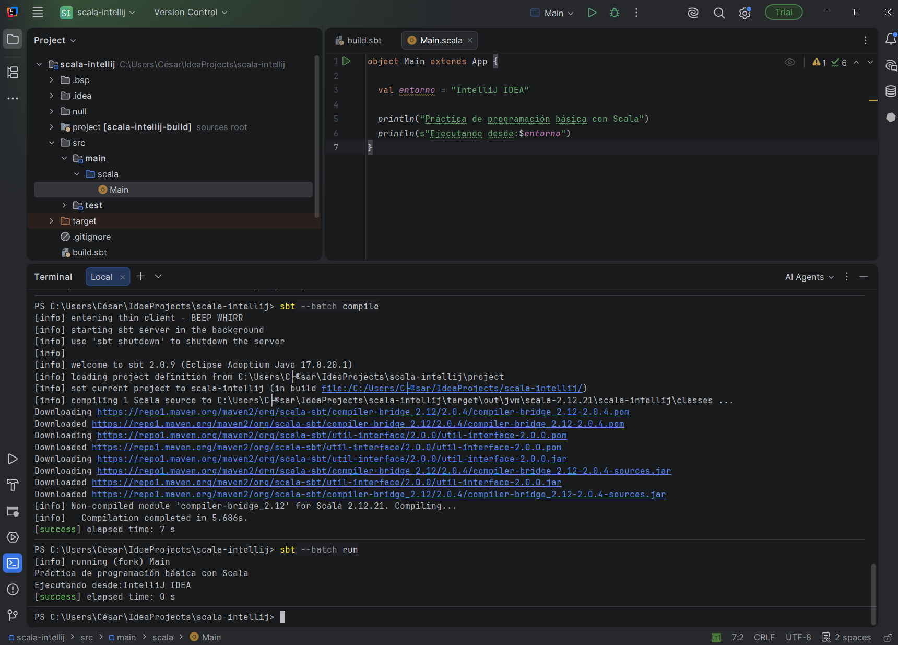
