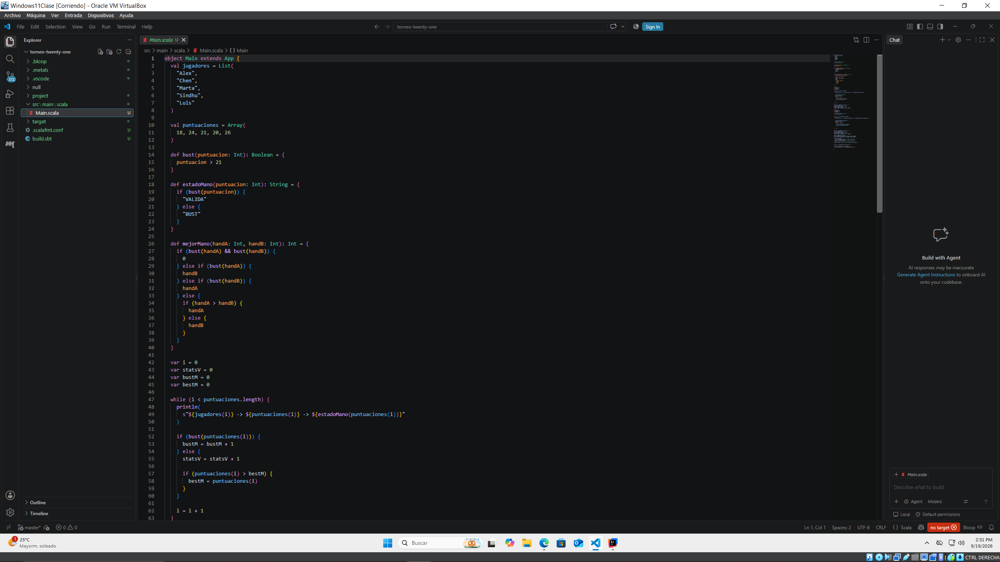
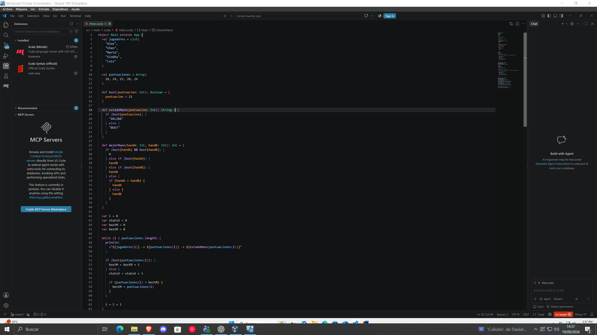
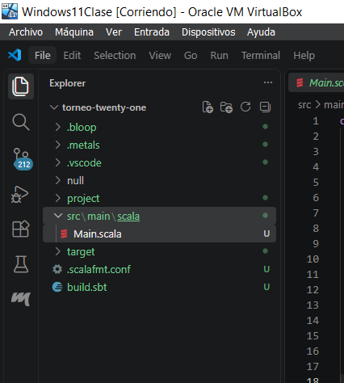
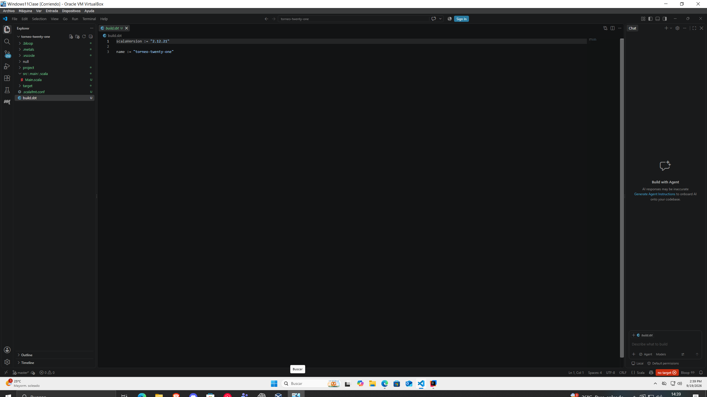
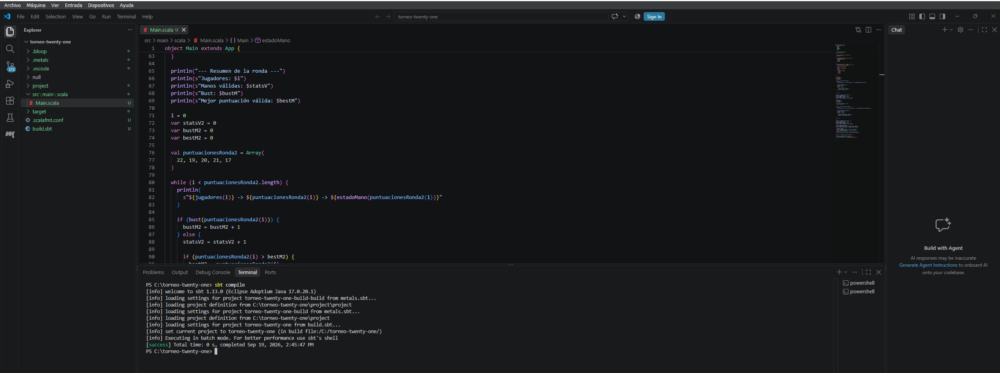
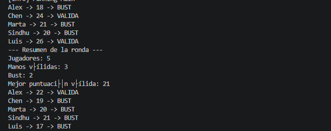
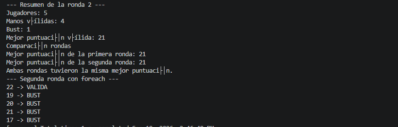

## Capturas del proyecto

### Visual Studio Code y proyecto

### Metals instalado

### Estructura del proyecto sbt

### build.sbt

### Main.scala

### Resultado de sbt compile

### Resultado de sbt run

### Primera ronda

### Segunda ronda

