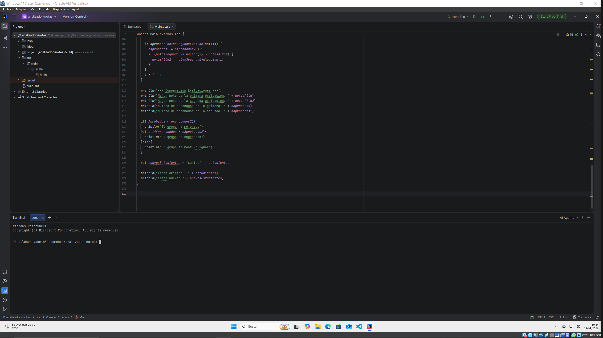
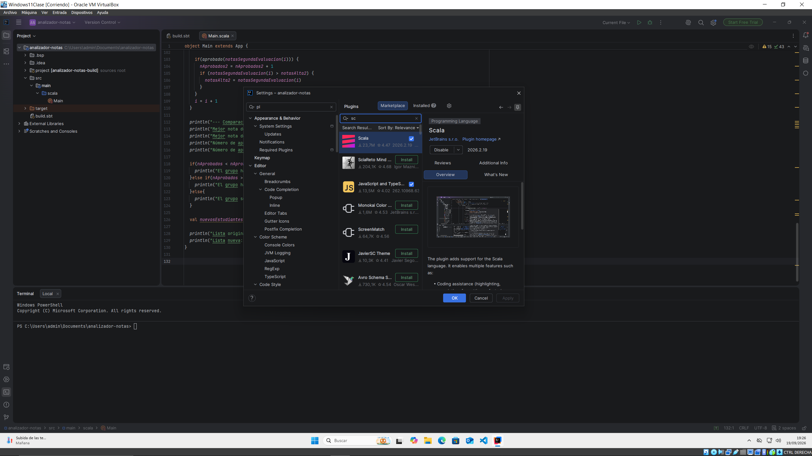
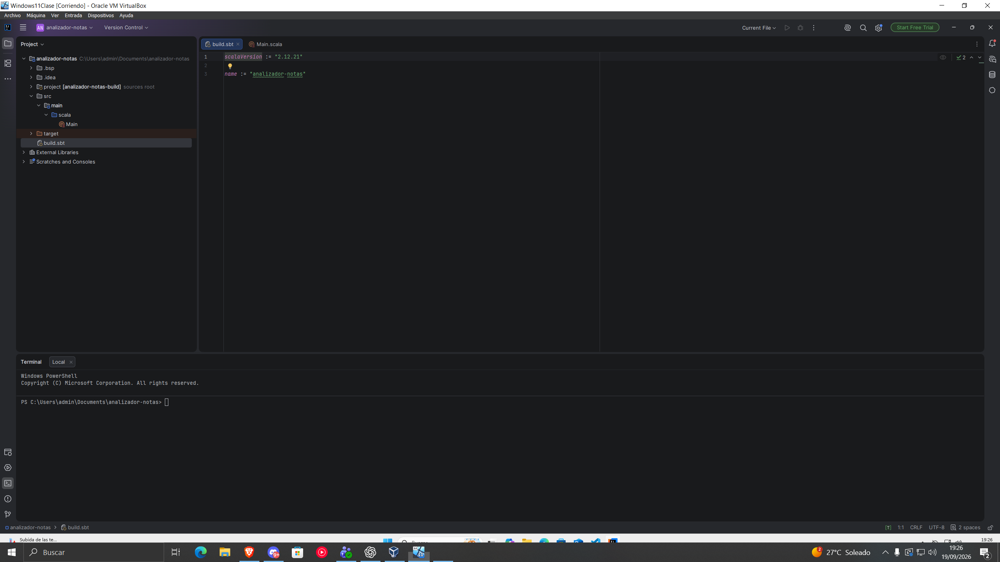
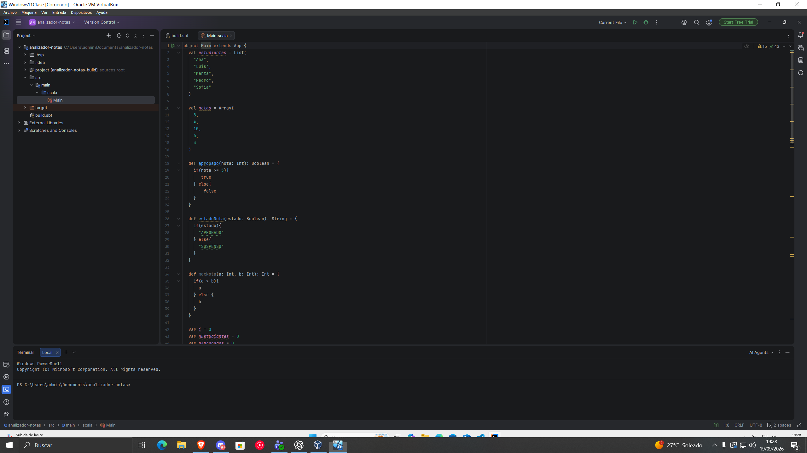
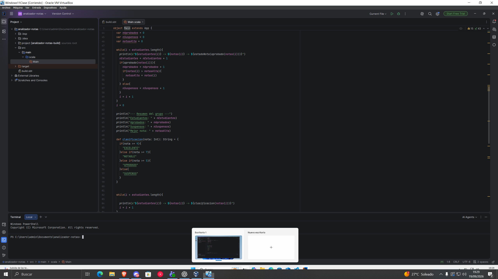
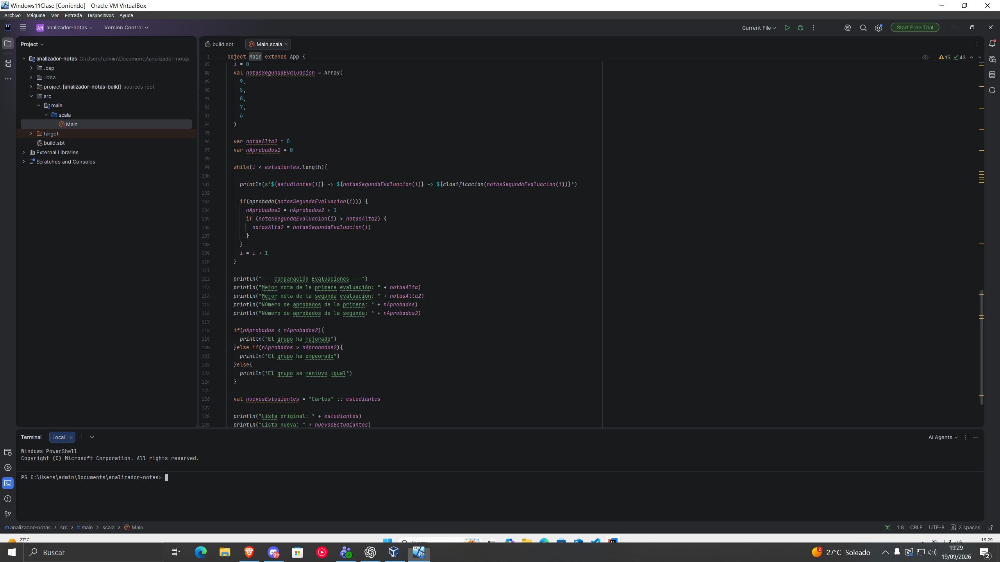
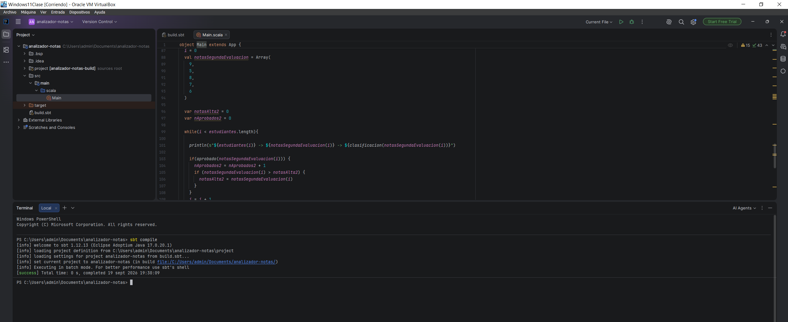
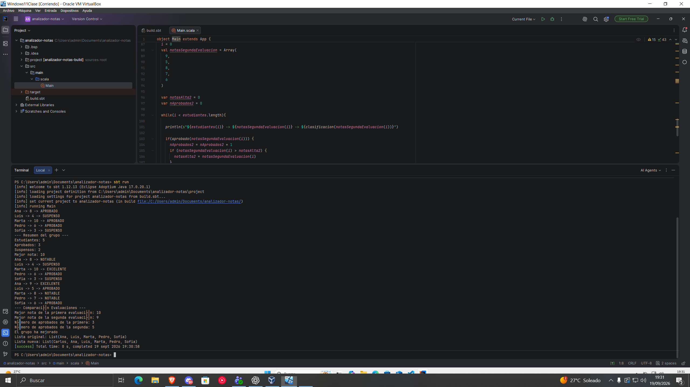
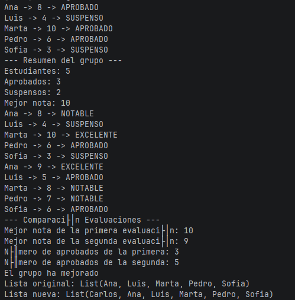
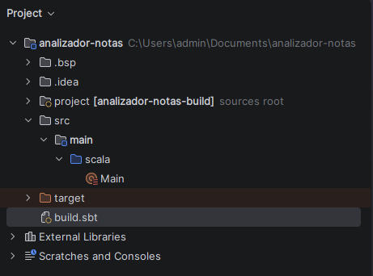

## Capturas del proyecto

### IntelliJ IDEA y proyecto

En esta captura se muestra el proyecto abierto en IntelliJ IDEA.
Puede observarse además la estructura principal del proyecto.

### Plugin de Scala

En esta captura se comprueba que el plugin de Scala está instalado y activo en IntelliJ IDEA.

### build.sbt

En esta captura se muestra el archivo build.sbt, donde se configura Scala 2.12.21 y se nombra al proyecto analizador-notas.

### Main.scala

En estas capturas se muestra el archivo Main.scala. En él se definen los estudiantes, sus notas, las funciones utilizadas y la lógica del proyecto para analizar las diferentes evaluaciones.

### Resultado de sbt compile

En esta captura se ejecuta el comando sbt compile desde la terminal de IntelliJ IDEA.
El resultado confirma que el código Scala se compila correctamente y que no existen errores de compilación.

### Resultado de sbt run

En esta captura se ejecuta el comando sbt run desde la terminal de IntelliJ IDEA.
El resultado muestra el proyecto en funcionamiento.

### Salida final de la aplicación

En esta captura se muestra la salida final del programa.
Puede observarse el análisis de las evaluaciones, el número de aprobados y suspensos, la mejor nota y la comparación entre ambas evaluaciones.

### Estructura del proyecto sbt

En esta captura puede observarse la estructura del proyecto sbt, incluyendo el archivo build.sbt y la carpeta src/main/scala donde se encuentra Main.scala.
